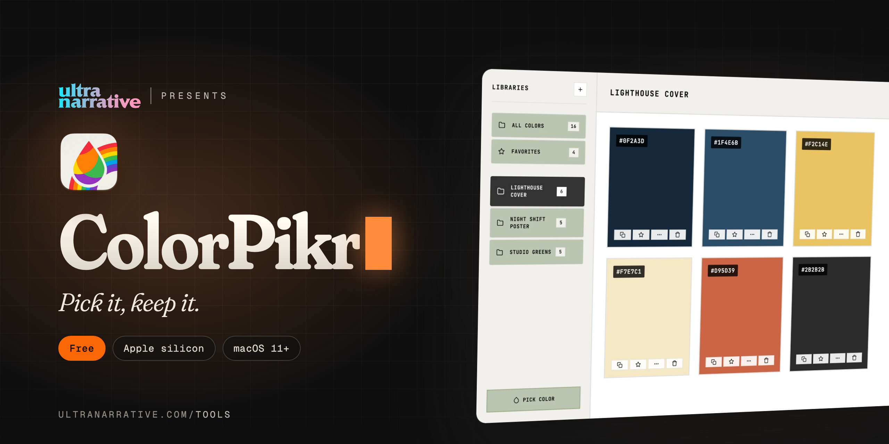

  

# ColorPikr

**Pick it, keep it.**

*Dan Rodriguez · [UltraNarrative](https://www.ultranarrative.com) · [ultranarrative.com/tools](https://www.ultranarrative.com/tools) · [dan@ultranarrative.com](mailto:dan@ultranarrative.com) · October 2026*

---

An eyedropper for any colour on screen, read in HEX, RGB, HSL and CMYK, and palettes to keep the ones you love.

Free, for a Mac with Apple silicon, macOS 11 or later. This repository holds the installer only. More free apps at [ultranarrative.com/tools](https://www.ultranarrative.com/tools).

## Download

[ColorPikr-mac-arm64.dmg](https://github.com/ultranarrative/colorpikr-releases/releases/latest/download/ColorPikr-mac-arm64.dmg)

This link always points to the newest version.

## Opening it the first time

I sign ColorPikr myself rather than through Apple, so macOS asks once. Open the disk image, drag ColorPikr to Applications and open it. When macOS stops it, go to System Settings, then Privacy & Security, and click Open Anyway.

## Support

ColorPikr is free, with no account and no subscription. If it helps you, [buy me a coffee](https://ko-fi.com/danrsuarez).

Made by Dan Rodriguez at [UltraNarrative](https://ultranarrative.com). © 2026 UltraNarrative. All rights reserved.
